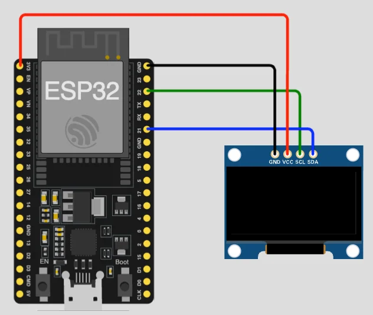
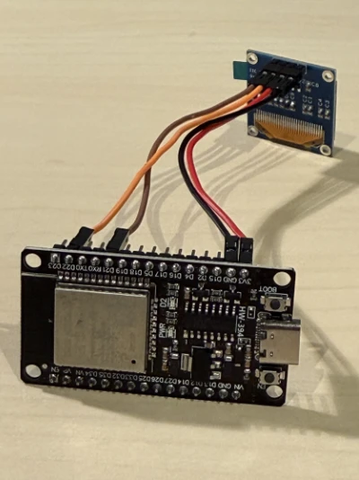
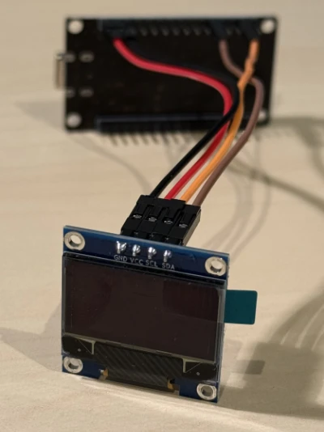

# ESP32 Mini OLED Webcam Stream (MediaPipe + Arduino)

Stream your phone or laptop webcam to a tiny 128x64 SSD1306 OLED. Your browser captures video, processes it into a 1-bit stylized frame (dithered, edges, motion trail, scanlines, skull, glitch, SHODAN), and pushes it to the ESP32 over WiFi. The ESP32 just receives and draws.

Works on **iPhone (Safari)**, **Android (Chrome)**, and any desktop browser. Browsers block `getUserMedia` on any LAN IP unless the page is HTTPS, so the sketch runs both an HTTP and an HTTPS server using a self-signed certificate you generate once.

Keywords: ESP32, SSD1306, mini OLED, MediaPipe, Face Landmarker, webcam, Arduino, PlatformIO, ESP-IDF, HTTPS, iOS Safari camera, Chrome camera, face tracking, 1-bit dithering.

<!-- YouTube walkthrough (TODO: replace thumbnail + video ID) -->

[](https://youtu.be/YOUR_VIDEO_ID)

## Features

- Single web page at `https://<esp32-ip>/` with live preview and 1-bit preview side by side.
- 7 styles, live-switchable: Dithered, Edges, Motion Trail, Scanlines, Skull, Glitch, SHODAN. Skull and SHODAN use MediaPipe face landmarks. The rest work on any camera feed.
- Front / back camera toggle (phones).
- One Start / Stop button, threshold + FPS sliders, debug stats panel.
- Works over HTTPS on LAN so camera access is unblocked everywhere.
- No external HTTPS library. Uses the built-in `esp_http_server` + `esp_https_server` that ship with ESP32 Arduino core 3.x.

## Hardware

| Part                                | Notes                                                        |
| ----------------------------------- | ------------------------------------------------------------ |
| ESP32 dev board                     | Any ESP32 with WiFi. ESP32-WROOM-32 is the classic.          |
| 0.96 inch SSD1306 OLED, 128x64, I2C | The 4-pin modules (VCC, GND, SCL, SDA).                      |
| 4 jumper wires                      | Female-to-female or female-to-male, depending on your board. |
| USB cable                           | For flashing.                                                |

Total cost around 10 to 15 USD.

## Wiring

Default pins: `SDA=21`, `SCL=22`.

| OLED | ESP32   |
| ---- | ------- |
| VCC  | 3.3V    |
| GND  | GND     |
| SCL  | GPIO 22 |
| SDA  | GPIO 21 |

If your OLED address is not `0x3C`, change `#define OLED_ADDR` near the top of the sketch. Any I2C scanner sketch will tell you the address.

### Step-by-step

1. **Power off** the ESP32 (unplug USB) while you connect wires.
2. Connect **GND** on the OLED to **GND** on the ESP32 (common ground for I2C).
3. Connect **VCC** on the OLED to **3.3V** on the ESP32. Most 4-pin SSD1306 modules expect 3.3 V; do not use 5 V unless your board’s silkscreen says it is 5 V tolerant.
4. Connect **SCL** on the OLED to **GPIO 22** on the ESP32.
5. Connect **SDA** on the OLED to **GPIO 21** on the ESP32.
6. Plug USB back in and upload the sketch. If the display stays blank, recheck GND/VCC and verify SDA/SCL are not swapped.

**Overview — signal routing**

<p align="center"></p>

<table>
<tr>
<th align="center">ESP32 end</th>
<th align="center">OLED module end</th>
</tr>
<tr>
<td align="center" valign="top"></td>
<td align="center" valign="top"></td>
</tr>
</table>

## Software setup (Arduino IDE)

### 1. Install the Arduino IDE

Download from [arduino.cc/en/software](https://www.arduino.cc/en/software). Version 2.x or newer.

### 2. Add ESP32 board support

1. **File > Preferences** (macOS: **Arduino IDE > Settings**).
2. In **Additional Board Manager URLs**, add:
   ```
   https://raw.githubusercontent.com/espressif/arduino-esp32/gh-pages/package_esp32_index.json
   ```
3. **Tools > Board > Boards Manager**, search **esp32**, install **esp32 by Espressif Systems**. You need version **3.0.0 or newer**, because the sketch uses the built-in `esp_https_server` component.

### 3. Install the libraries

**Sketch > Include Library > Manage Libraries**, then install:

- **Adafruit GFX Library**
- **Adafruit SSD1306**

That is all. No HTTPS library is needed because it ships with the ESP32 core.

### 4. Download this project

Grab the code from GitHub.

**Easy way (no Git required):**

1. Go to [github.com/sanderdesnaijer/esp32-mini-oled-webcam-stream-mediapipe](https://github.com/sanderdesnaijer/esp32-mini-oled-webcam-stream-mediapipe).
2. Click the green **Code** button, then **Download ZIP**.
3. Unzip it somewhere you can find again (Desktop is fine).
4. The folder will be named `esp32-mini-oled-webcam-stream-mediapipe-main`. Inside, double-click `browser-oled.ino` to open it in the Arduino IDE.

**Git way (if you already use Git):**

```
git clone https://github.com/sanderdesnaijer/esp32-mini-oled-webcam-stream-mediapipe.git
cd esp32-mini-oled-webcam-stream-mediapipe
```

Then open `browser-oled.ino` in the Arduino IDE.

> Arduino IDE may ask to move the `.ino` into its own folder. It is already in its own folder, so just click **Cancel** or **OK** (either works, the file stays where it is).

### 5. Select your board

- **Plug the ESP32 into your computer with a USB cable.**
- **Tools > Board > esp32 > ESP32 Dev Module** (or whichever matches your board).
- **Tools > Port** and pick the ESP32's serial port. On macOS it looks like `/dev/cu.usbserial-XXXX` or `/dev/cu.SLAB_USBtoUART`. On Windows it will be `COM3`, `COM4`, etc. If you don't see the port, you may need to install the CP210x or CH340 USB driver for your board (Google the chip name printed near the USB connector).

### 6. Configure WiFi

In the open sketch, edit these two lines near the top:

```cpp
const char* ssid     = "YOUR_WIFI_NAME";
const char* password = "YOUR_WIFI_PASSWORD";
```

### 7. Generate a certificate

The sketch will not compile until you paste a self-signed certificate and private key into it. This is a one-time step. Pick whichever option feels easier.

**Option A (recommended): use the web generator.** No install, works on any OS or phone, takes about 30 seconds.

1. Open [sanderdesnaijer.github.io/esp32-mini-oled-webcam-stream-mediapipe/cert-generator.html](https://sanderdesnaijer.github.io/esp32-mini-oled-webcam-stream-mediapipe/cert-generator.html).
2. Click **Generate**. The page creates a fresh 2048-bit RSA keypair and wraps it in a self-signed X.509 cert valid for 10 years. Everything runs locally in your browser. Nothing is uploaded. You can verify this by opening DevTools and watching the Network tab while you click Generate.
3. Click **Copy certificate**, then paste it over the `cert_pem[]` placeholder block in `browser-oled.ino`.
4. Click **Copy private key**, then paste it over the `key_pem[]` placeholder block.

**Option B: run the helper script locally** (if you prefer not to trust a web page with your own keys, or you want to verify the code). Requires a terminal and `openssl`.

```
bash scripts/generate_cert.sh
```

On macOS / Linux, the easiest way to get to the right folder is: open **Terminal**, type `cd ` (with a trailing space), drag the extracted project folder onto the Terminal window, press **Enter**, then paste the command above.

The script prints two blocks of C code. Copy them and paste them over the `cert_pem[]` and `key_pem[]` placeholders in `browser-oled.ino`.

**Option C: plain openssl** (any platform with openssl installed):

```
openssl req -x509 -newkey rsa:2048 -nodes \
  -keyout key.pem -out cert.pem -days 3650 \
  -subj "/CN=esp32.local"
```

Open `cert.pem` and `key.pem` in a text editor. For each line, wrap it as `"line\n"` and paste inside the matching block in the sketch. Keep the `-----BEGIN-----` and `-----END-----` lines.

**Do not commit your private key to a public repo.** `cert.pem` and `key.pem` are already in `.gitignore`. The only file that ends up with keys is your local `browser-oled.ino`, which is why you should not commit your edited sketch back to this repo.

### 8. Upload

Click the **Upload** arrow. The first compile takes a few minutes because mbedtls and the HTTPS server components get linked in. Subsequent builds are fast.

Open the **Serial Monitor** at 115200 baud:

```
Connecting to WiFi..........
Connected. IP address: 192.168.1.93
HTTP  listening on http://192.168.1.93/
HTTPS listening on https://192.168.1.93/
```

The OLED shows the same URL and waits for a browser to connect.

## Software setup (PlatformIO)

```ini
[env:esp32dev]
platform = espressif32 @ ^6.8.0
board = esp32dev
framework = arduino
monitor_speed = 115200
lib_deps =
    adafruit/Adafruit GFX Library
    adafruit/Adafruit SSD1306
```

Run the cert generator, paste, edit WiFi, `pio run -t upload`.

## First run

1. Wait for the OLED to show the `https://<ip>/` URL.
2. On your phone or laptop (same WiFi), open that exact URL. **Must be https, not http.**
3. The browser will show a "Not secure" or "Your connection is not private" warning. This is expected and safe in this case. See the note below if you want to understand why.
   - **iPhone / Safari:** tap **Show Details**, then **visit this website**, then **Visit Website**.
   - **Chrome / Android:** tap **Advanced**, then **Proceed anyway**.
4. Wait for `Ready. Press Start.` at the bottom of the page. The first load downloads the MediaPipe model (a few MB), later loads are cached.
5. Tap **Start** and allow camera access.
6. Pick a style. Your webcam now streams to the OLED.
7. Switch **Front** / **Back** camera anytime from the dropdown.

## About the browser security warning

The first thing your browser shows you on `https://<esp32-ip>/` is a scary-looking red warning. It is expected. Here is the honest explanation so you can decide for yourself whether to proceed.

**Why the warning appears.** Browsers want every HTTPS site to present a certificate signed by a trusted authority (like Let's Encrypt or DigiCert). That system exists for public websites on the open internet. Your ESP32 is not on the internet. It is a small device sitting on your own WiFi with a local IP like `192.168.x.x`. No public authority signs certificates for devices on your private network, so the ESP32 signs its own. The browser cannot verify a self-signed certificate, so it warns you. The same warning appears for your router's admin page, most printers, and most NAS devices for exactly this reason.

**What the warning does not mean in this case:**

- It does not mean the page is malicious.
- It does not mean your traffic is being watched. Your phone talks directly to the ESP32 on your own WiFi. Nothing leaves your network.
- It does not mean your camera feed is uploaded anywhere. All camera processing happens in your browser. The only thing sent to the ESP32 is the final 1-bit 128x64 image, which is all it can display.

**You can verify all of this yourself.** The entire sketch and web page is open source in this repo. Search the HTML for `fetch(` and you will see the only network call the page makes is a POST to your ESP32's IP address. Nothing else.

## How it works

The heavy work is in the browser:

1. `getUserMedia` opens the camera.
2. MediaPipe Face Landmarker runs on the GPU (WebGL).
3. A 128x64 canvas renders the chosen style using the raw frame and, for Skull / SHODAN, the landmarks.
4. The canvas is packed to SSD1306 page format (1024 bytes, 1 bit per pixel) and base64-encoded.
5. A POST to `/frame` on the ESP32 sends it.

The ESP32:

1. Receives the POST body.
2. Base64-decodes with a lookup table (around 40 microseconds for a frame).
3. Copies directly into the SSD1306 buffer, then pushes over I2C at 400 kHz.

That keeps the ESP32 side tiny and fast, so it comfortably handles 10 to 15 FPS. All the vision work stays in the browser.

## Tuning performance

- **FPS slider:** start at 10, lower it if WiFi is slow.
- **Threshold slider:** affects Edges style.
- **I2C clock:** 400 kHz in the sketch, some OLEDs tolerate 800 kHz. Edit `Wire.setClock(400000);`.

## Troubleshooting

**OLED shows nothing.** Check wiring and that `OLED_ADDR` matches your display (`0x3C` or `0x3D`).

**Compile error: "cert_pem is empty".** You skipped step 7. Generate a cert and paste it in.

**"Camera error: undefined is not an object".** You visited `http://` instead of `https://`. The sketch redirects HTTP to HTTPS, but if you typed the IP manually, type `https://`.

**First HTTPS visit keeps getting blocked.** Safari sometimes caches the refusal. Close the tab, clear it, and try again. If that fails, restart Safari.

**Frames flicker or drop.** Lower the FPS slider. Bottleneck is usually WiFi round trip, not the ESP32.

**Different LAN, same WiFi.** Some guest networks block peer-to-peer. Try your main WiFi.

## License

MIT. Credit appreciated but not required.

## Credits

- [MediaPipe Face Landmarker](https://developers.google.com/mediapipe/solutions/vision/face_landmarker) by Google.
- [Adafruit SSD1306](https://github.com/adafruit/Adafruit_SSD1306) and [Adafruit GFX](https://github.com/adafruit/Adafruit-GFX-Library) libraries.
- Built on top of the ESP-IDF [`esp_http_server`](https://docs.espressif.com/projects/esp-idf/en/latest/esp32/api-reference/protocols/esp_http_server.html) and [`esp_https_server`](https://docs.espressif.com/projects/esp-idf/en/latest/esp32/api-reference/protocols/esp_https_server.html) components.
